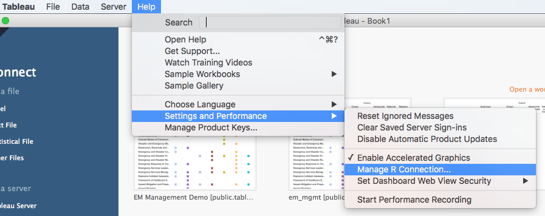

## Docker Containers for Rserve

[Rserve](http://www.rforge.net/Rserve/index.html) allows for R and Tableau (among others) to communicate. However,
given that Tableau isn't available for Linux, the majority of Linux users have to run tableau through a VM
(or borrow someone's mac?).  This container is meant to be a quick way to spin up a background instance of Rserve
that Tableau can communicate to, without having to install Rserve on either your host or guest machines.

There are two containers available for pulling,

1. The bare-metal `Rserve` server:
    
    ```bash
    docker pull stevenpollack/docker-rserve
    ```
  
  This image contains all the standard R packages available through [rocker/r-base](https://hub.docker.com/r/rocker/r-base/)
  as well as `Rserve`, and has a standard `Rserve` server (with port 6311 exposed) running as its
  entrypoint.
2. The demonstrative `btug` container:

    ```bash
    docker pull stevenpollack/btug
    ```
  
  This is based off of `stevenpollack/docker-rserve`, but also contains `devtools`,
  [`BayesianFirstAid`](https://github.com/rasmusab/bayesian_first_aid),
  `randomForest`, `RMySQL` and `hopach` R packages (these are used in a tableau workbook to
  demonstrate ways to integrate R and Tableau). Note that if you want to truly follow along
  with the notebook, you'll need MySQL installed on your computer. The easiest way to do
  this is with (again) docker's [mysql container](https://hub.docker.com/r/library/mysql/):
  
    ```bash
    docker pull mysql
    ```

## Running the containers:

You'll want to be sure to map the container's port 6311 to your localhost's 6311 and run the container
in the background, **BEFORE** starting Tableau. E.g.

```bash
docker run --name BTUG -p 6311:6311 -d stevenpollack/btug
```

If you are using the docker instance of MySQL, you'll want to link the two containers:

```bash
docker run --name MYSQL -p 3306:3306 -e MYSQL_ROOT_PASSWORD=swordfish -d mysql
docker run --name RSERVE --link MYSQL:mysql -p 6311:6311 -d stevenpollack/btug
```

the first command starts up the MySQL server, and the second command starts up the Rserve
serve, but links the MySQL container to it, so we can connect to it upon initialization.
(You can see how I wired that up by looking at the [btug dockerfile](btug)).

***N.B.,*** if you want to fork this and do your own crazy stuff, you'll probably want to
 know how to mess with `Rserve`. In which case, check out
 [this](http://stackoverflow.com/questions/20265682/finding-rserve-rconfig-file-on-ubuntu-13-10)
stackoverflow post for setting the `/etc/Rserv.conf` file

## Connecting Tableau and Rserve:
Regardless of how you're instantiating Rserve, you'll have to use Tableau's GUI, found at
 _Help_ > _Settings and Performance_ > _Manage R Connection_ to check the connection:



From here, you'll need to find the IP of the server that's running Rserve.

- If you're running Rserve from R (or RStudio), then the IP is `localhost`.
- If you're running Rserve through a docker container (highly recommended), then:
	- if you're on [Windows](https://docs.docker.com/engine/installation/windows/) or
	 [OS X](https://docs.docker.com/engine/installation/mac/), you can find the IP with the "URL" returned
	  from the `docker-machine ls` command. E.g, say you ran `docker-machine ls` from your terminal and saw
	
		```
		$ docker-machine ls
		NAME      ACTIVE   DRIVER       STATE     URL                         SWARM   DOCKER    ERRORS
        default   *        virtualbox   Running   tcp://192.168.99.100:2376           v1.10.2
		```
		
		Then, you'd know that your server IP is `192.168.99.100`.
	- if you're on Linux, then you're likely running Tableau through a VM. This means that while your host box
	 can access Rserve through `localhost`, your windows box (the guest) cannot. You need to find out your host
	 box's address. The simplest way to do this is from within the VM (assuming this is windows 8): 
		1. right clicking on the Start button (assuming this is Windows 8), and go to _Network Connections_
		2. double click on your ethernet adapter
		3. click on the connection _Details_ button
		4. find your _IPv4 Default Gateway_
	
		

Once you've got the IP of your Rserve server, you'll need the port. However, unless you've done something
special this should just be `6311`. Go ahead and click the _Test Connection_ button, and hopefully you'll
see a popup saying something like

> Successfully connected to the Rserve service.

If you encounter any errors and you're running Rserve through a container, be sure to
check that you've started Rserve with `remote=TRUE` (from within R):

```R
Rserve::run.Rserve(remote=TRUE)
```
